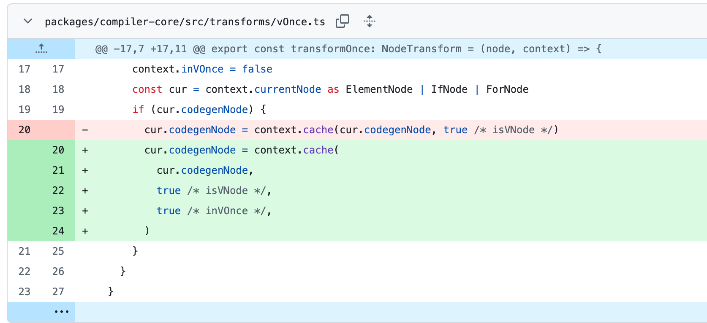
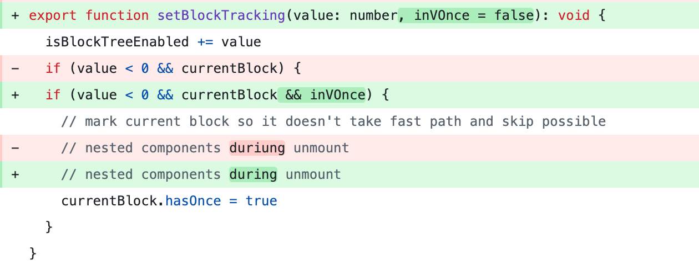

- issue : https://github.com/vuejs/core/issues/12371 
- commit : https://github.com/vuejs/core/commit/37300fc26190a7299efddbf98800ffd96d5cad96#diff-d6421efff87ae857257b7e9d39b5623bfd948f0982a0c16284b38ccf9caecbaf 

---
컴포넌트가 제대로 마운트 해제되지 않습니다. (3.5.12 - onBeforeUnmount 동작 이슈)

처음엔 왜 vOnce파일을 건드렸을까? 했는데, 
v-once 디렉티브는 해당 노드의 렌더 결과를 한 번만 계산하고, 이후에는 재활용(caching)하여 다시 렌더링하지 않는 최적화 기능을 하고 있다.

v-once를 적용한 컴포넌트는 처음 렌더링 된 후 캐싱되기때문에 onBeforeUnmount가 실행되지 않는 것이 맞지만 그게 아닐 경우엔 마운트가 해제 되어야한다. 

하지만 아래와 같이 컴포넌트 내부 slot에 다른 컴포넌트를 사용할 시에 v-once디렉티브를 사용하지 않아도 3.5.12 버전에서 정상 해제되지 않았다. 

```javascripts
<script setup lang="ts">
import { ref } from 'vue';
import ComponentThatIsNotProperlyDestroyed from './ComponentThatIsNotProperlyDestroyed.vue';
import Page from './Page.vue';

const on = ref(false);
</script>

<template>
  <div class="App">
    <button @click="on = !on" >Toggle page</button>

    <Page v-if="on" >
      <template #headline>
        <h3>Headline</h3>
      </template>

      <template #content >
        <ComponentThatIsNotProperlyDestroyed  />
      </template>
    </Page>
  </div>
</template>

```
그래서 캐시 저장 시, inVOnce옵션과 함께 저장한 후,

vnode에서 해당 옵션을 함께 확인하는 과정을 거칠 수 있도록 처리되었다. 


> [테스트 하기](https://play.vuejs.org/#eNqtVW1v0zAQ/iu3gNRuahOhwpfRdTCYxJAYE4xvkZhJLok3145sp1tV9b9zdl66Tu0U0Pol9t1zr37uugo+lmW4qDA4DqYm0by0YNBWJQgm85M4sCYOZrHk81JpCyvQmMEaMq3mMCCzwftO90nRV6K01wWzF+ZS2SutStRi+RmN1WqJaWMXRj2wLqlH3q9Yjp25u7T6WCZKGgtKwonLbpgxYfCQNNOoLojSp4vFeSmYRboBTFO+gEQwY6hE6oCvEeg3/VNZS64+JIInd6T0bg+UjAOYXas8FwglRZ9GNdD79oY+wcWYZ97IwWsFqdrQ8KpAlgou6yQabTGZfWnE04gunVn0KOUdvqhsSx3cxCFtnzeAaHeIWuDKqFsUUY/otIUJRkQICpzxPLw1ShJrVg4cBwlF5gL199Jyeo84OAavcTomhLr/6mVWVzhq5UmByd0O+a15cLI4uNJoUC8wDjqdZTpHW6vPf17iA5075VyllSD0M8ofaJSoXI417KySKaX9COezvfCs4zK/NucP1GbTFuUSdci1x8cBsdA1fV/pm3Qn4VtvF8s1dbFlsBu7bWYaTJybjp0OuaHnwXgM99wWqrJgC24840Zw0+Phb+CImyMoGzmk3aSFIYzHbYRi0rLYDxKFRq2Vbqi5Pw0k8Ism4ka0drvhq4vr490zA5UhNtO3ZLQfVAYMPKGAu6MRynpUihlNVgpKQ0FX6rVdQjM7ZhMOYLWC187KhO2UnobDQzilVyQ6giPLkr5resEuHx9FsjlSuxqfBGkHrB0hd2qe9elA9dq5Sp5hpjT+knNVSTvqBN/c9ek6juWWekg1nMxcxUR8DIXKhwO3wRz7th0NDt3W3Jg34Xo5aLC1i63FS2Tvue37/gW9eDt65vff3fpX//ub+cy/WI8g1MYeqH2L//cCtVuD9EyT8F34ZhKs/wIAws+g)