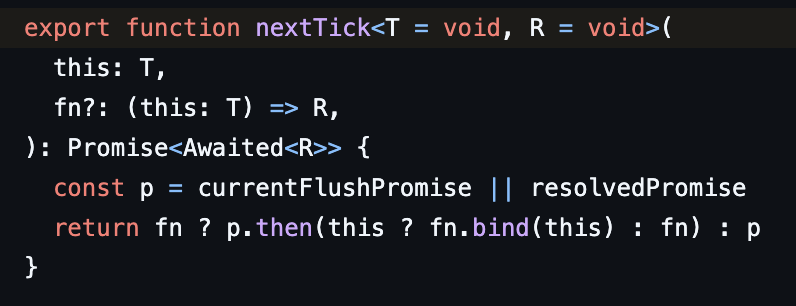

# Vue 톺아보기

## nextTick

[nextTick](https://vuejs.org/api/general.html#nexttick)은 상태 변경 직후에 DOM 업데이트가 완료될 때까지 대기하는 데 사용할 수 있습니다. 콜백을 인자로 전달하거나, 프로미스(Promise) 반환을 기다릴 수 있습니다.

1. **currentFlushPromise**
쌓인 queue 가 있고 처리중인 경우 참조하게 되는 변수로 [queueFlush](https://github.com/vuejs/core/blob/7278d35213168ab072eb0f988106b993a4f8a0f7/packages/runtime-core/src/scheduler.ts#L114)이 호출될 때 값이 할당되며 [flushJobs](https://github.com/vuejs/core/blob/7278d35213168ab072eb0f988106b993a4f8a0f7/packages/runtime-core/src/scheduler.ts#L209) 이 호출되고 값이 해제 된다.

2. **queueFlush 의 호출 단계 (1)**
a. [render](https://github.com/vuejs/core/blob/main/packages/runtime-core/src/renderer.ts#L2366)
b. [processComponent](https://github.com/vuejs/core/blob/main/packages/runtime-core/src/renderer.ts#L1128)
c. [mountComponent](https://github.com/vuejs/core/blob/main/packages/runtime-core/src/renderer.ts#L1165)
d. [setupRenderEffect](https://github.com/vuejs/core/blob/main/packages/runtime-core/src/renderer.ts#L1275)
e. [queueJob](https://github.com/vuejs/core/blob/7278d35213168ab072eb0f988106b993a4f8a0f7/packages/runtime-core/src/scheduler.ts#L94)
f. queueFlush

### 참조

[Test](https://github.com/vuejs/core/blob/main/packages/runtime-core/__tests__/scheduler.spec.ts#L7)

## watch는 어떻게 동작하는가?

그동한 무지성으로 사용해 왔지만 대략적으로라도 동작원리를 알아보기 위해 여러 케이스 중 하나인 ref 타입의 방식을 분석해 보았다.

1. [target에 대한 effect 생성](https://github.com/vuejs/core/blob/d65b25cdda4c0e7fe8b51e000ecc3696baad0492/packages/reactivity/src/watch.ts#L288)
2. [effect run 함수를 실행하며 의존성 주입](https://github.com/vuejs/core/blob/d65b25cdda4c0e7fe8b51e000ecc3696baad0492/packages/reactivity/src/watch.ts#L316)
 2-1. [effect.run](https://github.com/vuejs/core/blob/main/packages/reactivity/src/effect.ts#L167) 과정에서 activeSub 할당
 2-2. [ref.getter](https://github.com/vuejs/core/blob/main/packages/reactivity/src/dep.ts#L102) 과정에서 할당 된 activeSub 읽어 의존성 주입
3. [ref set 동작 시 trigger 호출](https://github.com/vuejs/core/blob/main/packages/reactivity/src/ref.ts#L155)
4. [endBatch를 통해 watch cb 호출](https://github.com/vuejs/core/blob/main/packages/reactivity/src/dep.ts#L161)
