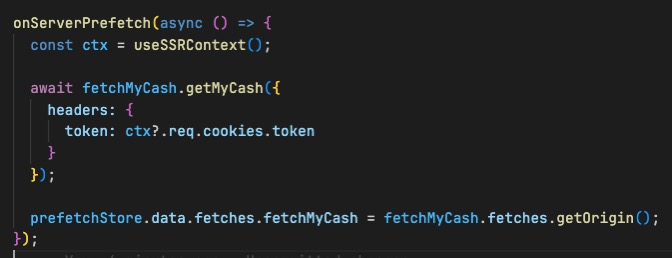
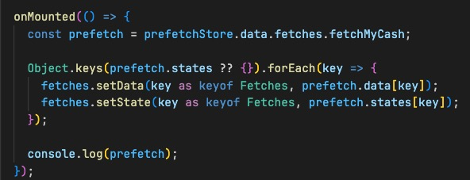
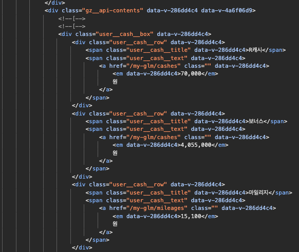

# SSR 동작 확인해 보기

## 시작하기

### Client & Server 코드 작성

Client와 Server에서 앱을 로드하기 위한 공통으로 사용하는 코드를 작성합니다.

``` typescript
// main.js
const app = createSSRApp(App);
const pinia = creatpPinia();
const router = createRouter();
const head = createHead();

app.use(pinia);
...

return {
  app,
  pinia,
  router
};
```

### Client 코드 작성

``` typescript
  const { app, pinia, router } = await run();

  router.isReady().then(() => {
    app.mount('#app');
  });
```

### Server 코드 작성

express에서 진입 시 render(entry-server.js)를 호출합니다.

``` typescript
// server.js
async function createServer(isProd = process.env.NODE_ENV === 'production') {
  // render = entry-server.js
  // template = index.html

  app.use(/(.*)/, async (req, res) => {
    try {
      const url = req.originalUrl;
      const userAgent = req.get('User-Agent');
      const userAgentParser = UAParser(userAgent);
      const device = 'mobile' === userAgentParser.device.type ? 'mobile' : 'desktop';
      const isCrawler = false; // userAgent.test(//);
      let render;
      let html;

      if (isProd) {
        render = entryRender;
      } else {
        // always read fresh template in dev
        template = await vite.transformIndexHtml(
          url,
          template
        );
        render = (await vite.ssrLoadModule('./src/entry-server.ts')).render;
      }

      const {
        html: appHTML,
        headTags,
        state,
        preloadLinks,
        isRedirected,
        currentPath
      } = await render({ req }, url, manifest);

      // if(isCrawler) {
      html = template[device]
        .replace('<!--preload-links-->', preloadLinks)
        .replace('<!--ssr-outlet-->', appHTML)
        // .replace('<!--head-tags-->', headTags)
        .replace('<!--store-state-->', state);
      // }
      // else {
      //   html = template.replace(`<!--preload-links-->`, preloadLinks).replace(/\<\$\= title \$\>/g, Math.random());
      // }

      res.status(200).set({ 'Content-Type': 'text/html' }).end(html);

      html = null;
      
    } catch (ex) {
      vite?.ssrFixStacktrace(ex);
      res.status(500).end(ex.stack);
    }
  });
}
```

render함수 에서 [vue 인스턴스](Client_&_Server_코드_작성)를 가져오고 [renderToString](https://vuejs.org/api/ssr#rendertostring)을 통해 html 내용물을 가져옵니다.

``` typescript
// entry-server.js
export async function render(context: Context, url: string, manifest: any) {
  const { app, pinia, router } = await run({
    req: context.req,
    device: context.device,
    renderType: 'ssr'
  });

  // set the router to the desired URL before rendering
  await router.push(url);
  await router.isReady();

  // passing SSR context object which will be available via useSSRContext()
  // @vitejs/plugin-vue injects code into a component's setup() that registers
  // itself on ctx.modules. After the render, ctx.modules would contain all the
  // components that have been instantiated during this render call.
  const ctx = {
    vueServerContext: context
  } as any;

  const html = await renderToString(app, ctx);
  const state = xss(JSON.stringify(pinia.state));
  // const { headTags } = await renderHeadToString(head);

  // the SSR manifest generated by Vite contains module -> chunk/asset mapping
  // which we can then use to determine what files need to be preloaded for this
  // request.
  const preloadLinks = renderPreloadLinks(ctx.modules, manifest);

  return {
    html,
    // headTags,
    state,
    preloadLinks
  };
}
```

다시 [server.js](Server_코드_작성)로 돌아가서 Client측으로 HTML을 응답합니다.

## Server 측에서 데이터 주입하기하고 Client에서 사용하기

1. onServerPrefetch를 사용하여 Server에서 데이터를 조회하고 주입합니다.



2. Server에서 조회 한 데이터를 Client 환경에 주입합니다.



3. 그리고 소스보기를 통해 SSR이 정상적으로 동작했는지 확인 합니다.



이와같이 최초 페이지 진입 시에는 SSR환경으로, 그 이후에는 CSR 환경으로 동작하게 됩니다.
